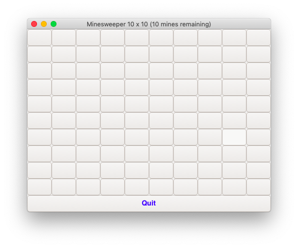
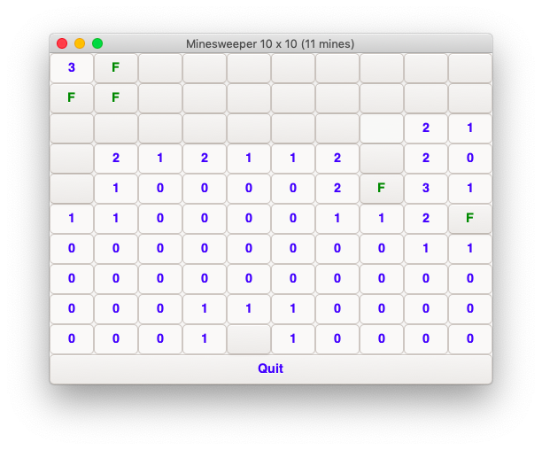
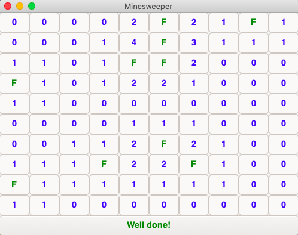
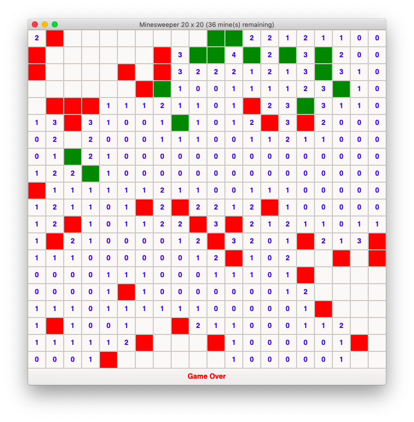

# Minesweeper
A Minesweeper game in C

# Installation
Download the repository, open it in terminal and run `make`. To play, enter 

`src/main [gui|cli] [width] [height] [mine count]`

# Features
- The player chooses the grid dimensions and the number of mines.
- (GUI version) Colour-coded button labels.
- (GUI version) Left-clicking on a cell reveals it, right-clicking on a cell flags/unflags it.
- (Command-line version) Whitespace is ignored when entering commands.
- (Command-line version) At most one command may be entered at a time. (This helps prevent mistakes.)
- (Command-line version) Entering an invalid command displays instructions. (They are also displayed at the start.)

# GUI Screenshots
Game Start                              | Mid-Game                             
:--------------------------------------:|:------------------------------------:
 | 
Game Won                                | Game Lost                           
     |  
