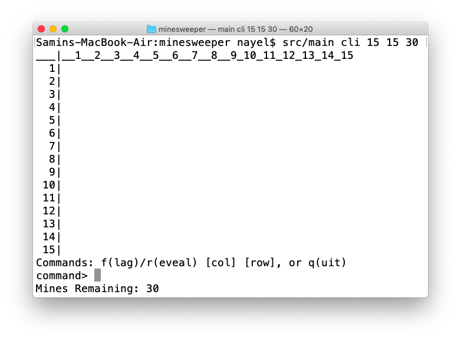
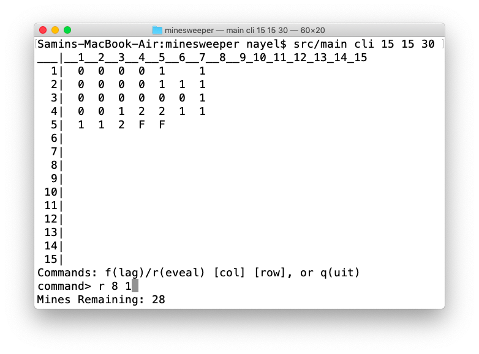
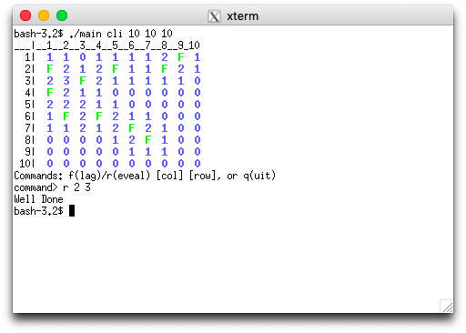
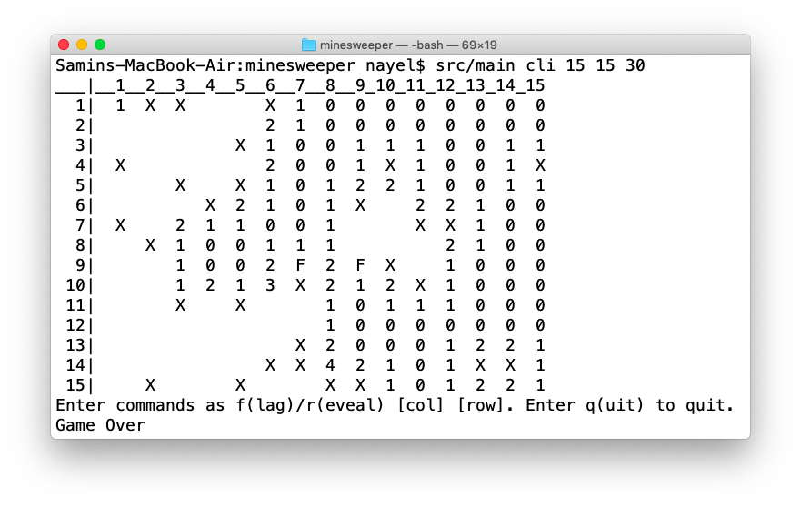

# Minesweeper
A Minesweeper game for Unix-like systems

# Features
- The player chooses the grid dimensions and the number of mines.
- Colour-coded grid labels.
- GUI: Left-clicking on a cell reveals it, right-clicking on a cell flags/unflags it.
- CLI: Separate terminal; extra spaces and invalid commands are ignored.

# Installing and Playing
- `git clone https://github.com/nayel71/minesweeper.git`
- `cd minesweeper`
- `make`
- `./main [gui|cli] [width] [height] [mine count]`

# Requirements
[GTK](https://www.gtk.org)

# CLI Screenshots
|
:-------------------------------------:|:-----------------------------------:
    |

# GUI Screenshots
|
:-------------------------------------:|:-----------------------------------:
    |

