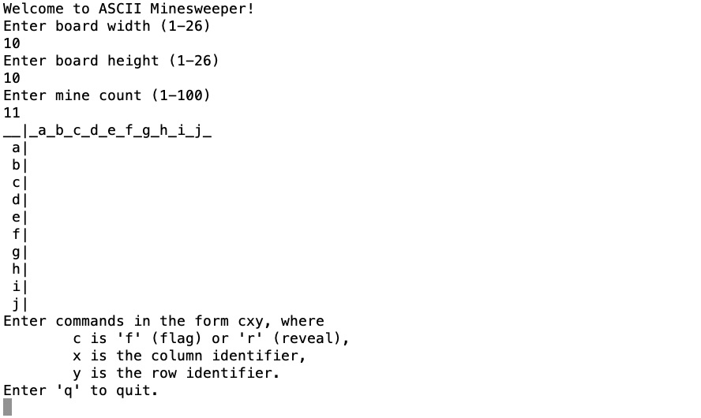
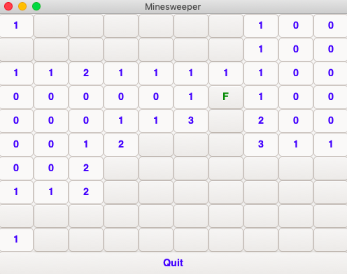
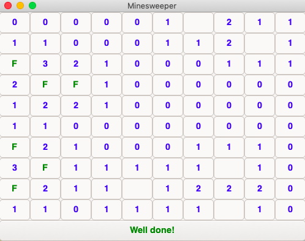
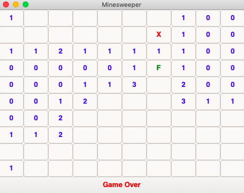

# Minesweeper
A Minesweeper game in C

# Installation
Download the repository, open it in terminal and run `make`. 

# Gameplay
### Command-Line Version
On the terminal, enter `./play`.

### GUI Version
On the terminal, enter `gui/gui [width] [height] [mine count]`.

# Features
- The player chooses the grid dimensions and the number of mines.
- (GUI version) Colour-coded button labels.
- (GUI version) Left-clicking on a cell reveals it, right-clicking on a cell flags/unflags it.
- (Command-line version) Whitespace is ignored when entering commands.
- (Command-line version) At most one command may be entered at a time. (This helps prevent mistakes.)
- (Command-line version) Entering an invalid command displays instructions. (They are also displayed at the start.)

# Screenshots

### Command-Line

### GUI

