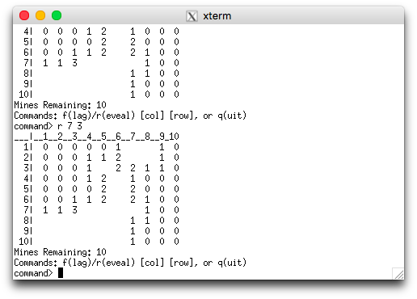

# Minesweeper
A Minesweeper game in C

# Installation
Download the repository, open it in terminal and run `make`. To play, enter 

`src/main [gui|cli] [width] [height] [mine count]`

# Pre-requisites

- [GTK](https://www.gtk.org)
- A terminal supporting ANSI escape codes

# Features
- The player chooses the grid dimensions and the number of mines.
- (GUI version) Colour-coded button labels.
- (GUI version) Left-clicking on a cell reveals it, right-clicking on a cell flags/unflags it.
- (CLI version) Separate terminal.
- (CLI version) Spaces and invalid commands are ignored.

# CLI Screenshots
|
:-------------------------------------:|:-----------------------------------:
    |

# GUI Screenshots

