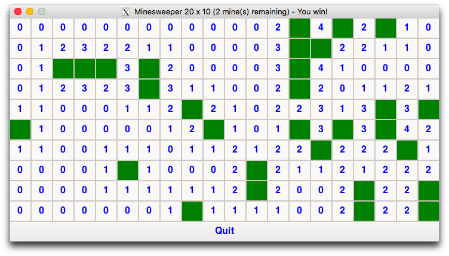

# Minesweeper
A Minesweeper game

## Features
- The player chooses the grid dimensions and the number of mines.
- **GUI:** Left-clicking on a cell reveals it, right-clicking on a cell flags/unflags it. 
- **CLI:** Separate terminal; extra spaces and invalid commands are ignored.
- **GUI (Python):** `Restart` button

## Requirements
C Version|Python Version
:-------:|:------------:
[GTK](https://www.gtk.org) | [Tkinter](https://docs.python.org/3/library/tkinter.html)

## Installation
- `git clone https://github.com/nayel71/minesweeper.git`
- `cd minesweeper`
- `make` (C version)

## Starting the Game
C Version|Python Version
:-------:|:------------:
`./main [gui\|cli] [width] [height] [mine count]`| `python src/[gui\|cli].py [width] [height] [mine count]`

## Screenshots

